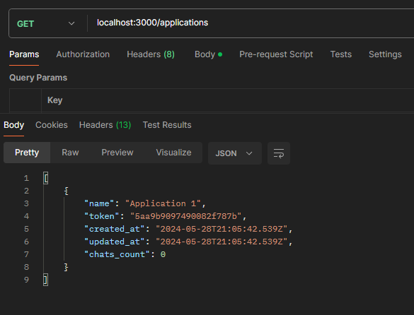
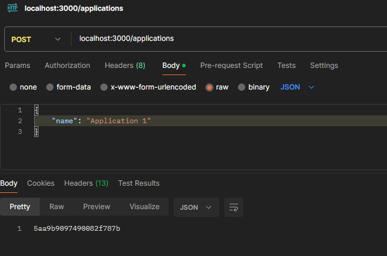
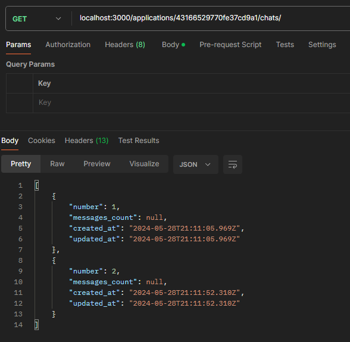
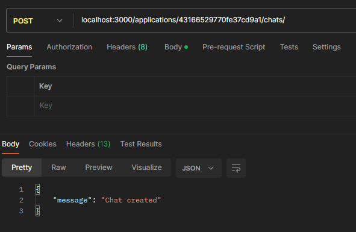

# Chat System README
This application includes all the APIs and supporting backend required for the user to be able to create applications that have chats, with every chat containing messages. Some of the key features include searching for messages within chats, as well as updating and deleting each entity as desired.

# Prerequisites:
    1. Docker
    2. Repo: https://github.com/DanaTamer/chat-app

# How to run the app
    1. Clone the repo
    2. Run the following command: docker-compose up

# Technologies Used
* Main Technologies
    - Ruby on Rails (v7.1.3.3): This project is built using Ruby on Rails, the popular web application framework.
    - Ruby (v3.3.1): Main language used.
    - MySQL (v8.0.36): MySQL is used as the primary database for long-term data storage. It helps ensure data integrity and scalability.
    - Sidekiq (v7.2.4): Sidekiq is used for queuing and executing background jobs, which helps handle race conditions and asynchronous tasks efficiently.
    - Redis (v7.0.2 5.2.0): Redis is utilized as a datastore for Sidekiq jobs, providing temporary storage to improve application performance by offloading tasks from the main database.
    - Redlock (v2.0.6): Redlock is employed for handling Redis mutex locks, enabling concurrency control and preventing race conditions in distributed systems.

* Containerization and Orchestration
    - Docker (v26.1.1): Docker is used for containerization, allowing the application and its dependencies to be packaged into portable, isolated containers.
    - Docker Compose: Docker Compose is used for orchestration, enabling the management and deployment of multi-container Docker applications with a single configuration file.

# Example screenshots:
  
  Applications GET method: returns the available applications with their token, name, date the app was created at, and the date it was last updated on, as well as the number of chats in this application.
  

  Applications POST method: creates a new application with the desired name.
  

  Chats GET method: given the token of a certain application, this endpoint returns all the chats in this application.
  

  Chats POST method: creates a new chat in the specified application.
   